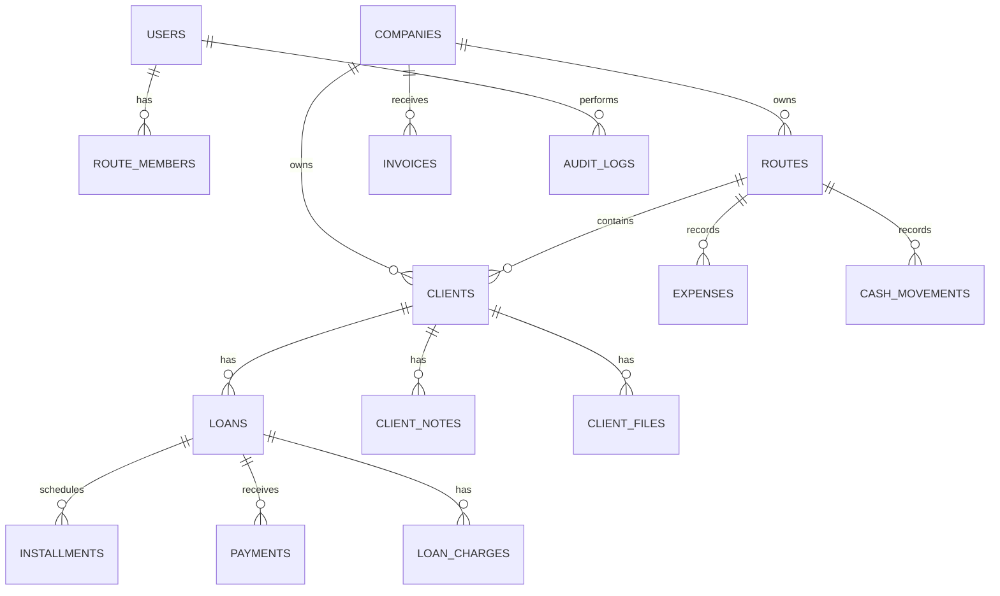

# PrestaBIT - Documento maestro de inspeccion y planificacion MVP web

Fecha: 31 de julio de 2026  
Version movil inspeccionada: Android `3.2.4` (`versionCode 324`)  
Paquete Android: `app.web.groons.prestabit`  
Web inspeccionada: `https://prestabit.vercel.app/`  
Objetivo: documentar todo lo observado en APK, app movil y web admin para planificar una app web MVP.

## 1. Resumen ejecutivo

PrestaBIT es un sistema para gestion de prestamos, rutas de cobranza, clientes, abonos, caja, gastos, balances, documentos, usuarios, facturacion y soporte por WhatsApp. La aplicacion movil es el producto mas completo y operativo; la web admin existente ya cubre varias funciones de escritorio, pero tiene modulos incompletos y algunas diferencias frente al movil.

La conclusion principal es clara: el MVP web no debe construirse como una pagina informativa ni como un CRUD aislado. Debe ser una herramienta operativa para administrar cartera desde escritorio, tomando como base:

- La logica y profundidad de la app movil.
- La organizacion desktop de `prestabit.vercel.app`.
- Un modelo financiero auditable y testeable.
- Una arquitectura web semantica, mantenible y preparada para roles, PDF y sincronizacion.

La web existente es muy util como referencia funcional, pero no conviene copiarla tecnicamente tal cual porque esta hecha en Flutter Web renderizado en canvas, con accesibilidad limitada para automatizacion/testing, modulos en desarrollo y algunos comportamientos inconsistentes.

## 2. Alcance de la inspeccion realizada

### APK/APKS

Se inspecciono el archivo:

- `app.web.groons.prestabit_3.2.4.apks`

Hallazgos:

- App Flutter.
- Paquete Android: `app.web.groons.prestabit`.
- Version: `3.2.4`.
- Min SDK: `24`.
- Target SDK: `36`.
- Firebase, Google Play Billing, Google APIs, OneDrive/Graph, PayPal, PDF, SQLite, impresoras Bluetooth.
- Endpoints API y rutas internas extraidas del binario.
- Esquema SQLite y entidades inferidas.

### App movil

Se probo en Android real conectado por USB.

Datos de prueba creados:

- Usuario/cuenta de prueba.
- Ruta: `RUTA DEMO`.
- Cliente: `CLIENTE DEMO`.
- Prestamo: capital `$100,000`.
- Abono completo: `$100,001`.

Flujos inspeccionados:

- Registro/login.
- Seleccion y creacion de ruta.
- Home.
- Clientes.
- Crear cliente.
- Detalle cliente.
- Crear prestamo.
- Contrato prestamo.
- Abono.
- Historial financiero.
- Tabla de cuotas.
- Caja/base.
- Gastos.
- Resumen.
- Balances.
- Ajustes.
- Planes/factura.
- WhatsApp bot.
- Importadores.
- Soporte.

### Web admin

Se inspecciono:

- `https://prestabit.vercel.app/`

Hallazgos:

- Es Flutter Web.
- Login funcional.
- Sincroniza con la app movil.
- Tiene modulos de escritorio: clientes, resumen, solicitudes, gastos, prestamos, caja, balances, empresa, rutas, usuarios, WhatsApp, factura y cuenta.
- Tiene modulos en desarrollo: contratos, reportados, configuracion.

## 3. Sistemas y arquitectura observada

### Tecnologias

Movil:

- Flutter Android.
- SQLite/local storage.
- Firebase.
- API propia.
- WebSocket.
- Google Play Billing.
- BLE/Bluetooth printing.
- PDF.

Web existente:

- Flutter Web.
- CanvasKit.
- Firebase Auth/Database/Functions.
- PDF.js.
- API propia.
- PWA manifest basico.

Backend/servicios detectados:

- API principal: `https://api.andresperezmelo.com.co/`
- WebSocket: `ws://api.andresperezmelo.com.co/prestabit/socket`
- Firebase RTDB: `https://prestabiit-default-rtdb.firebaseio.com`
- Web admin: `https://prestabit.vercel.app/`
- Web historica: `https://prestabiit.web.app/#/`
- PayPal Cloud Function.
- Microsoft Graph/OneDrive.
- Google Drive appdata.
- WhatsApp links.

## 4. Modulos del producto

### Autenticacion y cuenta

Funciones observadas:

- Login con email y contrasena.
- Registro de usuario.
- Reset de contrasena.
- Validacion de token.
- Cierre de sesion.
- Eliminar sesiones.
- Actualizar password.
- Plan/licencia.
- Datos personales.
- Estado de suscripcion.

Para MVP:

- Login.
- Registro opcional si el producto sera abierto.
- Recuperacion de contrasena.
- Perfil/cuenta.
- Sesion segura.
- Estado de licencia visible, aunque pago real puede quedar fuera de fase 1.

### Rutas

Funciones observadas:

- Crear ruta con nombre y descripcion.
- Seleccionar ruta activa.
- Administrar rutas.
- Editar ruta.
- Eliminar ruta.
- Filtrar clientes/prestamos/resumen por ruta.
- Rutas permitidas por usuario/cobrador.

Regla clave:

- La ruta es contexto operativo central. Clientes, prestamos, caja, resumen y usuarios dependen de ruta.

Para MVP:

- CRUD de rutas.
- Selector de ruta global.
- Asignacion de clientes a ruta.
- Filtros por ruta en clientes, prestamos, resumen, caja y balances.

### Clientes

Movil:

- Listado con filtros: todos, para hoy, pendientes, pagados, atrasados, activos.
- Grupos de clientes.
- Crear/editar cliente.
- Fotos/evidencias.
- Detalle cliente.
- Acciones: nuevo prestamo, solicitar, recordar.
- Menu amplio: editar, calificar, reportar, contrato, estado cuenta, carta saldo, mover ruta, notas, congelar, recuperacion.

Web:

- Tabla desktop.
- Buscador por nombre/direccion.
- Filtros por ruta/grupo/estado.
- Nuevo cliente.
- Acciones por fila.
- Formulario completo con identificacion, telefono, WhatsApp, direcciones, fecha nacimiento, ruta, sexo y fotos.

Para MVP:

- Tabla de clientes.
- Busqueda.
- Filtros.
- Crear/editar cliente.
- Asignar ruta.
- Estado financiero resumido.
- Ver detalle cliente.
- Notas.
- Historial de prestamos.
- Fotos pueden quedar en fase 2 si el primer MVP debe ser mas corto.

### Prestamos

Movil:

- Buscar cliente por cedula.
- Nombre/alias del prestamo.
- Amortizacion.
- Capital.
- Modalidad.
- Tipo de pago.
- Porcentaje de interes.
- Cuotas.
- Valor cuota.
- Fecha de inicio.
- Dias sin cobro.
- No cobrar sabado/domingo.
- Mora.
- Cargos.
- Fiador.
- Fotos.
- Contrato.
- Tabla de cuotas.

Web:

- Formulario desktop claro.
- Buscar/validar documento.
- Capital, amortizacion, modalidad, esquema, interes, fecha, cuotas, valor cuota.
- No cobrar sabados/domingos.
- Mora, cargos, fiador, tabla.

Comportamiento observado:

- Prestamo con capital `$100,000`, interes `0`, una cuota diaria:
  - Total calculado: `$100,001`.
  - Ganancia: `$1`.
  - Abono completo: `$100,001`.

Esto puede ser una regla de redondeo/ajuste minimo. Debe validarse antes de implementar el motor financiero.

Para MVP:

- Crear prestamo.
- Calcular cuotas.
- Ver tabla de cuotas.
- Estados: activo, completado, vencido, en recuperacion.
- Editar prestamo con auditoria.
- No eliminar fisicamente movimientos financieros.

### Abonos / pagos

Movil:

- Panel de abono dentro del cliente.
- Tipo de abono: automatico, mixto, mora, cargos, descuento.
- Medio de pago: efectivo, tarjeta, transferencia, oficina.
- Valor a abonar.
- Incrementar/decrementar cuotas.
- Imprimir/compartir.
- Historial financiero.

Web:

- Resumen refleja abonos.
- Prestamos muestra accion financiera, pero detalle no fue tan completo para prestamo finalizado.

Regla clave:

- Un abono no es solo un pago; puede distribuirse entre capital, interes, mora, cargos o descuento.

Para MVP:

- Registrar abono.
- Desglose capital/interes/mora/cargos/descuento.
- Medio de pago.
- Historial append-only.
- Reverso/anulacion controlada, no borrado simple.
- Recibo PDF basico.

### Historial financiero y ledger

Observado:

- El historial muestra desembolso inicial.
- El historial muestra abono capital/interes.
- Despues del abono completo, el prestamo pasa a `COMPLETADO`.
- Tabla de cuotas muestra pagada, actual, vencida, futura.

Para MVP:

- Ledger de movimientos por cliente/prestamo.
- Movimientos inmutables.
- Ajustes mediante reversos.
- Filtros por fecha/tipo.
- Exportacion/recibo.

### Solicitudes de prestamo

Movil y web:

- Listado de solicitudes.
- Filtros por estado: todas, pendientes, aprobadas, rechazadas.
- Filtro por ruta.
- No se vio creacion manual clara desde la pantalla vacia.

Para MVP:

- Puede quedar como fase 2.
- Si entra en fase 1, que sea simple: crear solicitud, aprobar/rechazar, convertir en prestamo.

### Caja, bases y movimientos

Movil:

- Accion rapida caja abre `Agregar base`.
- Campos: descripcion, fecha, monto recibido por cobrador, monto entregado a empresa.
- Ajustes > Caja tiene saldo, reset, nuevo movimiento, ingreso/egreso.

Web:

- Selector de ruta.
- Saldo disponible.
- Ingresos/egresos.
- Nuevo movimiento.
- Historial 30 dias.
- Resetear caja.
- Exportar PDF.

Para MVP:

- Caja por ruta.
- Movimientos ingreso/egreso.
- Concepto, monto, fecha.
- Saldo calculado.
- Relacion con abonos y gastos definida claramente.
- Resetear solo con permisos altos y auditoria.

### Gastos

Movil:

- Control de gastos.
- Total.
- Ultimos gastos.
- Nuevo gasto en bottom sheet.
- Concepto, valor, fecha, categoria.

Web:

- Formulario fijo.
- Historial de gastos.
- Filtro por rango.
- Editar/eliminar.
- Total gastos.

Para MVP:

- CRUD de gastos.
- Categoria opcional.
- Filtro por fecha/ruta.
- Incluir en resumen/balances.
- Auditoria para editar/eliminar.

### Resumen / dashboard

Movil:

- Cobrado.
- Prestado.
- Gastos.
- Finalizados.
- Progreso de cobranza.
- Meta.

Web:

- Balance general.
- Meta diaria.
- Detalle de recaudo.
- Distribucion de caja.
- Historial de movimientos.

Para MVP:

- Dashboard diario.
- Filtro por ruta y fecha.
- Cobrado, prestado, gastos, ganancia.
- Distribucion por medio de pago.
- Movimientos recientes.

### Balances

Movil:

- Resumen de cartera.
- Pendiente cobro.
- En recuperacion.
- Capital, interes, mora, cargos.
- Desembolsos.
- Recaudacion.

Web:

- Panel de control.
- Rango de fechas.
- Resumen cartera.
- Estadisticas: balance, mora, ROI, reportes PDF.
- Resumen financiero.

Observacion:

- En la web, `Resumen` reflejo el prestamo/abono de prueba, pero `Balances` mostro valores en cero. Puede ser filtro, fecha, cartera finalizada o bug. Debe validarse.

Para MVP:

- Balance basico por fecha/ruta.
- Cartera activa.
- Cobros.
- Desembolsos.
- Gastos.
- Ganancia.
- Mora/cargos en fase 2 si se necesita recortar.

### Documentos/PDF

Movil:

- Contrato prestamo.
- Ver PDF.
- Agregar firma.
- Imprimir.
- Compartir.
- Estado de cuenta.
- Carta saldo.
- Historial PDF/impresion.

Web:

- PDF.js incluido.
- Factura PDF.
- Caja exportar PDF.
- Contratos en desarrollo.

Para MVP:

- Recibo de abono PDF.
- Estado de cuenta simple.
- Contrato basico puede ser fase 2, salvo que sea requisito comercial.

### Usuarios, roles y permisos

Movil:

- Gestionar usuarios/subcuentas.
- Plan oro habilita subcuentas.

Web:

- Crear usuario.
- Usuario `@prestabit.com`.
- Contrasena.
- Estado activo/inactivo.
- Rutas permitidas.
- Permisos granulares.

Permisos observados:

- Hacer pagos.
- Agregar clientes.
- Agregar prestamos.
- Agregar gastos.
- Agregar cargos.
- Editar clientes.
- Editar prestamos.
- Eliminar prestamos.
- Eliminar gastos.
- Eliminar abonos.
- Eliminar fotos.
- Reimprimir.
- Trabajar sin conexion.
- Ver resumen dia.
- Ver balances.
- Ver ganancias.

Para MVP:

- Admin propietario.
- Cobrador.
- Supervisor.
- Permisos por modulo/accion.
- Rutas permitidas.
- Auditoria por usuario.

### Empresa y recibos

Movil:

- Ajustes empresa.
- Cupos.
- Logo.
- Recibos.

Web:

- Nombre empresa.
- Telefono comercial.
- Direccion fisica.
- Simbolo de moneda.
- Eslogan/lema.
- Pie de recibo.

Para MVP:

- Datos empresa.
- Moneda.
- Pie de recibo.
- Logo puede ser fase 2.

### Facturacion y planes

Movil:

- Plan ORO.
- Vencimiento.
- Factura.
- Planes.
- Costos por clientes, fotos, WhatsApp bot.
- Google Play/PayPal.

Web:

- Factura.
- Consumo del periodo.
- Clientes.
- Prestamos.
- Cloud MB.
- WhatsApp.
- Bot.
- Mensajes.
- Pagar ahora.
- Descargar PDF.

Para MVP:

- Mostrar plan/licencia.
- Mostrar consumo basico.
- Pago real puede quedar fuera del primer MVP.
- No mezclar facturacion SaaS con caja/prestamos.

### WhatsApp bot

Movil:

- Explicacion de bot.
- Conexion via WhatsApp Web.
- Horario programado.
- Plantillas.

Web:

- Servicio desconectado.
- Vincular con QR.
- Configuracion bloqueada.

Para MVP:

- Fuera de fase 1.
- Preparar estructura de recordatorios y plantillas para futura integracion.

### Reportados / mala paga

Movil:

- Wizard: cliente, empresa, detalles, prestamo.

Web:

- Funcion en desarrollo.

Para MVP:

- No incluir en fase 1 salvo que sea diferenciador obligatorio.
- Implica datos personales sensibles y debe tener revision legal.

### Importadores y backups

Movil:

- Importar desde PrestaBIT V1.
- Importar desde PrestaCOP.
- Google Drive/OneDrive/backups.

Web:

- Bundle incluye OneDrive/Graph y Google Drive appdata.

Para MVP:

- Importacion CSV/Excel en fase 2.
- Backups externos fuera de fase 1.

## 5. Modelo de datos recomendado

### Entidades base

### Tablas principales

`users`

- id
- company_id
- name
- email
- phone
- country
- role
- status
- created_at

`companies`

- id
- name
- phone
- address
- currency_symbol
- receipt_footer
- logo_url
- plan
- license_expires_at

`routes`

- id
- company_id
- name
- description
- active
- created_at

`route_members`

- id
- route_id
- user_id
- permissions

`clients`

- id
- company_id
- route_id
- document_type
- document_number
- full_name
- phone
- whatsapp
- home_address
- work_address
- birth_date
- gender
- group_name
- credit_limit
- rating
- status
- created_at

`loans`

- id
- client_id
- route_id
- code
- alias
- principal
- interest_rate
- interest_amount
- total_amount
- installment_amount
- installments_count
- amortization_type
- payment_frequency
- payment_scheme
- start_date
- end_date
- status
- no_charge_saturday
- no_charge_sunday
- guarantor_data
- contract_template_id
- created_by
- created_at

`installments`

- id
- loan_id
- number
- due_date
- principal_amount
- interest_amount
- charge_amount
- mora_amount
- total_amount
- paid_amount
- balance
- status

`payments`

- id
- loan_id
- client_id
- route_id
- amount
- principal_paid
- interest_paid
- mora_paid
- charges_paid
- discount_amount
- payment_type
- payment_method
- receipt_number
- note
- created_by
- created_at
- voided_at
- void_reason

`cash_movements`

- id
- route_id
- type
- amount
- concept
- source_type
- source_id
- created_by
- created_at

`expenses`

- id
- route_id
- concept
- category
- amount
- date
- created_by
- created_at

`audit_logs`

- id
- company_id
- user_id
- action
- entity_type
- entity_id
- before
- after
- created_at

## 6. Reglas de negocio criticas

1. La ruta activa determina el contexto operativo.
2. Un cliente puede tener multiples prestamos historicos.
3. El prestamo debe generar tabla de cuotas.
4. Todo abono debe distribuirse en componentes financieros.
5. El historial financiero debe ser auditable.
6. No se deben borrar pagos sin reverso.
7. Caja, gastos y prestamos deben estar separados contablemente.
8. La facturacion SaaS no debe mezclarse con caja de prestamos.
9. Los permisos deben aplicarse en frontend y backend.
10. Documentos PDF deben generarse desde datos versionados.
11. Offline/sync no debe improvisarse; si entra, requiere cola y resolucion de conflictos.
12. Reportes de mala paga manejan datos sensibles y requieren control legal/privacidad.

## 7. Brechas entre movil y web existente

| Area | Movil | Web existente | Decision MVP |
|---|---|---|---|
| Clientes | Muy completo | Tabla desktop buena | Combinar ambos |
| Prestamos | Flujo completo | Formulario desktop bueno | Usar web como UX base |
| Abonos | Muy completo | Parcial en detalle | Replicar movil |
| Historial | Completo | Resumen global | Crear detalle web |
| Contratos | Funcional | En desarrollo | Fase 2 o MVP si requerido |
| Reportados | Funcional | En desarrollo | Fuera de fase 1 |
| Gastos | Basico | Muy bueno | Tomar web |
| Caja | Bueno | Bueno, con estado inicial raro | Tomar web y corregir |
| Balances | Bueno | Potente pero posible inconsistencia | Implementar con tests |
| Usuarios | Basico | Muy bueno | Tomar web |
| WhatsApp | Explicado/configurable | QR bloqueado | Fase 3 |
| Factura | Bueno | Bueno | Mostrar, pago luego |

## 8. MVP recomendado

### Objetivo del MVP

Construir una web operativa para administrar cartera de prestamos desde escritorio, con foco en clientes, prestamos, abonos, resumen diario y control basico de caja/gastos.

### Usuarios objetivo

- Administrador/dueno.
- Cobrador.
- Supervisor.

### Alcance fase 1

Debe incluir:

- Login.
- Dashboard inicial.
- Rutas.
- Clientes.
- Crear/editar cliente.
- Crear prestamo.
- Motor de cuotas.
- Ver detalle cliente.
- Registrar abono.
- Historial financiero.
- Tabla de cuotas.
- Recibo PDF basico.
- Gastos.
- Caja basica.
- Resumen diario.
- Balances basicos.
- Usuarios/permisos basicos.
- Datos empresa basicos.

Debe excluir:

- Pago real de factura.
- PayPal/Google Play.
- WhatsApp bot.
- Backups externos.
- Importadores complejos.
- Reportados/mala paga.
- Contratos avanzados con firma.
- Impresion Bluetooth.
- Offline completo.

## 9. Arquitectura recomendada para nuevo MVP

### Recomendacion principal

Construir una app web nueva con stack web semantico, no Flutter Web.

Stack recomendado:

- Frontend: Next.js + React + TypeScript.
- UI: componentes propios o shadcn/ui con ajustes sobrios.
- Backend: API REST o tRPC/Server Actions.
- DB: PostgreSQL.
- ORM: Prisma o Drizzle.
- Auth: Auth.js, Supabase Auth o JWT httpOnly propio.
- Validacion: Zod.
- PDF: HTML-to-PDF server-side.
- Realtime futuro: WebSocket/Supabase Realtime.
- Offline futuro: IndexedDB + sync queue.
- Tests: Vitest/Jest para motor financiero, Playwright para flujos.

### Principios tecnicos

- Calculos financieros en backend o libreria compartida testeada.
- Ledger append-only.
- Permisos aplicados del lado servidor.
- Auditoria para acciones sensibles.
- PDFs generados desde snapshots de datos.
- UI desktop densa, no landing page.
- Tablas con filtros y acciones claras.
- Formularios con validacion fuerte.

## 10. Plan de pantallas para MVP

### Layout global

- Sidebar.
- Header con ruta activa, usuario y plan.
- Area principal responsive.
- Selector de fecha/ruta donde aplique.

### Pantallas

1. Login.
2. Inicio/dashboard.
3. Clientes.
4. Nuevo/editar cliente.
5. Detalle cliente.
6. Nuevo prestamo.
7. Detalle prestamo.
8. Registrar abono.
9. Historial financiero.
10. Tabla de cuotas.
11. Gastos.
12. Caja.
13. Resumen.
14. Balances.
15. Rutas.
16. Usuarios/permisos.
17. Empresa.
18. Factura/licencia solo lectura.

## 11. Roadmap por fases

### Fase 0 - Preparacion

Duracion sugerida: 2 a 4 dias.

Entregables:

- Confirmar si se reutiliza API actual o se crea backend propio.
- Definir moneda/pais inicial.
- Definir reglas financieras exactas.
- Validar redondeo `$100,000 -> $100,001`.
- Definir roles iniciales.
- Definir si se migraran datos reales.

### Fase 1 - Nucleo operativo

Duracion sugerida: 2 a 4 semanas.

Entregables:

- Auth.
- Empresa.
- Rutas.
- Clientes.
- Prestamos.
- Cuotas.
- Abonos.
- Historial.
- Resumen diario.
- Gastos.
- Caja.

### Fase 2 - Documentos y administracion

Duracion sugerida: 2 a 3 semanas.

Entregables:

- Recibos PDF.
- Estado de cuenta.
- Contrato basico.
- Carta saldo.
- Usuarios/permisos completos.
- Balances avanzados.
- Auditoria visible.

### Fase 3 - Integraciones

Duracion sugerida: 3 a 6 semanas.

Entregables:

- WhatsApp bot.
- Facturacion/pagos.
- Importadores.
- Backups.
- Offline/PWA.
- Reportados.
- Impresion.

## 12. Backlog priorizado

### P0 - Imprescindible

- Autenticacion.
- Modelo DB.
- Rutas.
- Clientes.
- Motor de prestamos/cuotas.
- Abonos.
- Ledger/historial.
- Dashboard/resumen.
- Gastos.
- Caja.
- Permisos base.

### P1 - Alto valor

- Recibo PDF.
- Estado de cuenta.
- Balances por fecha.
- Usuarios/rutas permitidas.
- Empresa/recibos.
- Auditoria.

### P2 - Diferenciadores

- Contratos editables.
- Fotos/evidencias.
- Importacion CSV/Excel.
- Solicitudes.
- Notas/calificacion.
- Recuperacion/congelar.

### P3 - Avanzado

- WhatsApp bot.
- Pagos SaaS.
- Backups Drive/OneDrive.
- Offline.
- Reportados/mala paga.
- Impresion Bluetooth.

## 13. Riesgos

### Riesgos tecnicos

- Calculos financieros incorrectos.
- Inconsistencias entre resumen y balances.
- Sincronizacion/offline compleja.
- API actual sin documentacion.
- Flutter Web existente no facil de reutilizar.

Mitigacion:

- Tests exhaustivos del motor financiero.
- Ledger auditable.
- Contratos API documentados.
- Migracion por fases.

### Riesgos de producto

- Querer copiar toda la app movil desde el inicio.
- Mezclar modulo operativo con facturacion SaaS.
- No priorizar flujo cliente-prestamo-abono.

Mitigacion:

- MVP enfocado.
- Roadmap por fases.
- Validacion con datos reales de prueba.

### Riesgos legales/privacidad

- Reportar mala paga.
- Manejo de documentos personales.
- Fotos/evidencias.
- WhatsApp automatico.

Mitigacion:

- Consentimiento.
- Politicas de privacidad.
- Control de permisos.
- Auditoria.

## 14. Decisiones pendientes

1. Backend nuevo o API existente.
2. MVP online-only o PWA/offline parcial.
3. Mantener redondeo observado o corregirlo.
4. Roles exactos iniciales.
5. Documento PDF obligatorio en fase 1 o fase 2.
6. Facturacion visible o funcional.
7. Importacion de datos reales desde app actual.
8. Pais/moneda inicial.
9. Si se requiere compatibilidad exacta con PrestaBIT movil.

## 15. Recomendacion final

El camino mas sano es construir una web nueva, semantica y mantenible, tomando la web actual como referencia de UX desktop y la app movil como referencia de profundidad funcional.

Orden recomendado:

1. Definir backend y reglas financieras.
2. Crear modelo DB.
3. Implementar clientes/rutas.
4. Implementar prestamos/cuotas.
5. Implementar abonos/ledger.
6. Implementar resumen/caja/gastos.
7. Agregar PDF y permisos.

No conviene iniciar con WhatsApp, pagos, reportados, backups ni offline. Esos modulos son valiosos, pero despues de que el nucleo financiero este correcto.

## 16. Fuentes de esta documentacion

- Inspeccion APK/APKS de PrestaBIT Android `3.2.4`.
- Prueba dinamica en Android real via ADB.
- Web admin `https://prestabit.vercel.app/`.
- Bundle publico `main.dart.js`.
- Reporte previo: `prestabit_inspeccion_plan.md`.
- Reporte previo: `prestabit_web_inspeccion.md`.

