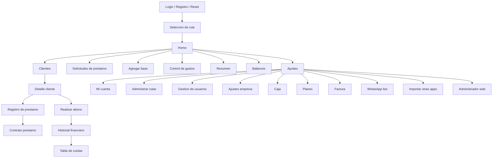

# PrestaBIT - inspeccion, mapeo y planificacion para MVP web

Fecha de inspeccion: 31 de julio de 2026  
Version inspeccionada: PrestaBIT Android `3.2.4` (`versionCode 324`)  
Paquete Android: `app.web.groons.prestabit`  
Dispositivo usado: Xiaomi 12T Pro, Android 15

## 1. Resumen ejecutivo

PrestaBIT es una app Flutter para prestamistas, orientada a rutas de cobro, clientes, prestamos, abonos, caja, gastos, balances, reportes, contratos, recibos, facturacion de licencia, subusuarios y sincronizacion nube/offline. La app actual combina operacion de campo diaria con administracion financiera.

Para construir una app web equivalente, el MVP no debe empezar como una landing ni como un CRUD generico. Debe replicar primero el circuito operativo:

1. Autenticacion, empresa/licencia y seleccion de ruta.
2. Gestion de clientes y grupos.
3. Registro de prestamos con motor de cuotas.
4. Cobro/abono con historial financiero.
5. Dashboard diario, resumen, balances.
6. Caja, bases y gastos.
7. Documentos basicos: recibos, contrato, estado de cuenta y carta de saldo.

La app ya tiene una entrada a web admin en `https://prestabit.vercel.app`, abierta desde Chrome Custom Tab. En el telefono cargo una pantalla de login web, por lo que existe una referencia funcional web que conviene inspeccionar aparte antes de escribir codigo del nuevo MVP.

## 2. Metodologia

Se hizo inspeccion mixta:

- APK/APKS estatico: manifiesto, permisos, actividades, servicios, assets, strings, endpoints y rutas internas Flutter.
- App instalada desde Google Play: navegacion con ADB, capturas de pantalla y dump XML de accesibilidad.
- Cuenta de prueba: se registro e ingreso una cuenta de prueba proporcionada por el usuario. No se documenta aqui la contrasena.
- Datos de prueba creados: ruta `RUTA DEMO`, cliente `CLIENTE DEMO`, prestamo de prueba por `$100,000` y abono completo por `$100,001`.

Acciones no ejecutadas por seguridad:

- Pagos reales, Google Play Billing, PayPal o compra de saldo.
- Borrado de cuenta, rutas, clientes o backups.
- Envio real de WhatsApp, SMS, llamadas o emails.
- Restauracion/subida de backups a Google Drive, OneDrive o servidor.
- Impresion Bluetooth real.
- Activacion de bloqueo biometrico o cambios de seguridad persistentes.

## 3. Arquitectura tecnica observada

### Android

- Framework principal: Flutter embedding 2.
- Main activity: `app.web.groons.prestabit.MainActivity`.
- WebView activity incluida.
- Firebase Auth/Realtime Database/servicios Google presentes.
- Billing client: version `8.0.0`.
- Soporte para biometria, huella y Bluetooth/impresoras.
- Idiomas localizados: espanol, ingles y portugues.
- Distribucion: APK firmado por Play App Signing.

### Permisos Android relevantes

- Internet y estado de red.
- Bluetooth clasico y BLE: `BLUETOOTH`, `BLUETOOTH_ADMIN`, `BLUETOOTH_CONNECT`, `BLUETOOTH_SCAN`.
- Biometria/huella: `USE_BIOMETRIC`, `USE_FINGERPRINT`.
- Wake lock.
- Google Play Billing.
- Firebase messaging.

### Servicios externos y URLs detectadas

- API principal: `https://api.andresperezmelo.com.co/`
- WebSocket: `ws://api.andresperezmelo.com.co/prestabit/socket`
- Firebase RTDB: `https://prestabiit-default-rtdb.firebaseio.com`
- Web admin: `https://prestabit.vercel.app/`
- Web/app historica: `https://prestabiit.web.app/#/`
- PayPal Cloud Function: `https://us-central1-prestabiit.cloudfunctions.net/createPaypalPayment?amount=`
- Microsoft Graph/OneDrive y Google Drive appdata scope.

## 4. Endpoints detectados

### Auth y cuenta

- `/auth/register`
- `/auth/singin`
- `/auth/sing_out`
- `/auth/validate_token`
- `/auth/update_user`
- `/auth/update_password`
- `/auth/delete_account`
- `/auth/delete_sessions`
- `/auth/get_subaccounts`
- `/auth/update_subaccount`
- `/auth/delete_subaccount`
- `/auth/license-info`
- `/auth/send_code`

### Dominio PrestaBIT

- `/prestabit`
- `/prestabit/home-data`
- `/prestabit/resumen-data`
- `/prestabit/balances-data`
- `/prestabit/balances-data-all`
- `/prestabit/clientes-data`
- `/prestabit/rutas`
- `/prestabit/add_ruta`
- `/prestabit/edit_ruta`
- `/prestabit/delete_ruta`
- `/prestabit/add_cliente`
- `/prestabit/update_clientes_batch`
- `/prestabit/update_clientes_ruta`
- `/prestabit/add_prestamo`
- `/prestabit/add_solicitud_prestamo`
- `/prestabit/solicitudes_prestamo`
- `/prestabit/add_gasto`
- `/prestabit/add_base`
- `/prestabit/add_or_update_caja`
- `/prestabit/reset_caja`
- `/prestabit/transacciones`
- `/prestabit/pagos_empleado`
- `/prestabit/add_pago_empleado`
- `/prestabit/get_empresa`
- `/prestabit/add_empresa`
- `/prestabit/get_pesos_datos_empresa`
- `/prestabit/pagar_factura`
- `/prestabit/validar-compra`
- `/prestabit/backups`
- `/prestabit/restore_bakup`
- `/prestabit/upload_all`
- `/prestabit/media/upload_archivos`
- `/prestabit/media/files_all`
- `/prestabit/media/delete_archivo`
- `/prestabit/web/clientes`
- `/prestabit/mensajes_visibles`
- `/prestabit/get_all_users`
- `/prestabit/get_token_impersonate_user`

### Reportes, sistema y soporte

- `/reportes/add`
- `/sistema/estado`
- `/whatsapp/session`
- `/users/backups`
- `/users/restaurar_usuario`
- `/root/get_sql`
- `/root/update_sql`
- `/root/delete_sql`

## 5. Modelo de datos inferido

Tablas SQLite detectadas:

- `clientes`
- `prestamos`
- `balances`
- `resumen`
- `caja`
- `gastos`
- `empresas`
- `bases`
- `eliminados`
- `local`
- `resumenesmes`

Entidades principales para web:

- `users`: usuario propietario, email, nombre, telefono, pais, rol.
- `companies`: datos de empresa, logo, cupos, plantillas, textos.
- `routes`: rutas de cobro, descripcion, responsable, estado de copia/sync.
- `route_members`: subcuentas, roles y permisos por ruta.
- `clients`: cedula, nombre, telefono, direccion, grupo, cupo, notas, calificacion, recuperacion.
- `client_files`: fotos/evidencias/documentos.
- `loans`: capital, interes, modalidad, cuotas, fechas, estado, contrato, mora, cargos, fiador.
- `installments`: tabla de cuotas, fecha, valor, saldo, estado.
- `payments`: abonos, tipo, medio, capital/interes/mora/cargos/descuento, recibo.
- `expenses`: gastos por concepto, categoria, valor, fecha.
- `cash_movements`: caja, bases, ingreso/egreso, recibido/entregado, movimientos.
- `loan_requests`: solicitudes pendientes/aprobadas/rechazadas.
- `reports`: reportes de mala paga y visitas.
- `reminders`: recordatorios de cobro/cliente.
- `invoices`: facturacion mensual, plan, consumos y saldo a favor.
- `sync_events`: cola offline, reconciliacion y auditoria.
- `audit_logs`: cambios financieros y administrativos.

Campos relevantes observados:

- Cliente: cedula, nombre, direccion, telefono, posicion, grupo, cupo, calificacion, historial de prestamos, pagado hoy, notas, en recuperacion.
- Prestamo: codigo, cliente/pertenece, capital, interes, porcentaje capital, cuota, plazo, fecha prestado, modalidad, dias por cuota, cuotas, abonos, fiador, contrato, cargos, mora, tipo operacion, prestamo origen, nombre/alias.
- Resumen: fecha/tiempo, tipo, valor, info, ganancia, caja, subido a servidor, eliminado, pertenece.
- Caja: caja, porcentaje capital, dias atraso, porcentaje atraso, dias vencido, porcentaje mora, descuento automatico de mora, movimientos.
- Balance: cobrado, prestado, gastos, mora, cargos, dinero en calle, ganancia, capital, intereses.

## 6. Mapa de navegacion

## 7. Pantallas y comportamiento

### Login y registro

- Login con email/password.
- Reset de password disponible.
- Registro solicita nombre, email, contrasena, pais, telefono y aceptacion de politicas.
- Si el usuario no existe, la app muestra error de Firebase.
- Registro exitoso entra a seleccion/configuracion inicial.

### Rutas

- Pantalla de rutas con tarjetas.
- Crear ruta requiere nombre y descripcion.
- Si falta descripcion, aparece modal: faltan datos.
- Ruta creada: `RUTA DEMO`.
- Ajustes permite cambiar rutas y administrar rutas.

### Home

Elementos:

- Version `v3.2.4`.
- Ruta activa.
- Saludo por horario y usuario.
- Plan/licencia y dias restantes.
- Fecha actual.
- Resumen del dia: cobros hoy, total esperado.
- Acciones rapidas: cliente, solicitud, caja, gasto.
- Proximos recordatorios.

### Clientes

Elementos:

- Total de clientes.
- Ruta activa.
- Grupos de clientes.
- Filtros: todos, para hoy, pendientes, pagados, atrasados, activos.
- Tarjeta cliente con nombre, estado de prestamos y saldos.

Crear/editar cliente:

- Informacion principal: nombre completo, cedula/ID, telefono, direccion.
- Informacion adicional: extras, trabajo y cupo.
- Evidencias y fotos: agregar foto, ver imagenes subidas.
- Boton guardar/actualizar cliente.

Detalle cliente:

- Header con volver, ubicacion, llamada y menu.
- Estado sin prestamos o tarjeta financiera del prestamo.
- Acciones: nuevo prestamo, solicitar, recordar.

Menu de cliente:

- Gestion de prestamo: nuevo, modificar, historial.
- Informacion cliente.
- Editar informacion.
- Calificar cliente.
- Reportar mala paga.
- Contrato prestamo.
- Estado de cuenta.
- Carta saldo.
- Mover de ruta cliente.
- Notas cliente.
- Congelar prestamo.
- Enviar a recuperacion.

Informacion cliente:

- Cedula, nombre, calificacion.
- Fecha nacimiento, sexo, grupo.
- Telefono/WhatsApp, direccion, direccion trabajo.
- Cupo habilitado/disponible.
- Prestamos realizados, total prestado, ruta ID.

Calificar cliente:

- Estados guia: bueno, regular, malo.
- Tags: puntual, amable, grosero, mala paga, no prestar, paga con dificultad, paga mora, recomendado, dificil contacto.

Reportar mala paga:

- Wizard por pasos: informacion del cliente, empresa, detalles del reporte, informacion del prestamo.

Notas:

- Modal/pantalla `Agregar Nota`.

Documentos:

- Estado de cuenta abre visor PDF.
- Carta saldo abre visor PDF.
- Contrato prestamo abre contrato con imprimir, compartir, cambiar contrato, ver PDF y agregar firma.

### Prestamos

Formulario:

- Datos del cliente: cedula, buscar cliente, cliente seleccionado.
- Opciones: fotografias, seleccionar contrato.
- Detalles: nombre/alias, amortizacion, capital, modalidad, tipo de pagos, porcentaje de interes total, numero de cuotas, valor cuota, fecha inicio.
- Modalidad visible por defecto: diario, cada 1 dias.
- Tipo de pagos visible: a cuotas.
- Campos inferiores: dias sin cobro, sabado/domingo, tabla de cuotas, configurar mora, cargos adicionales, datos del fiador, fotos, registrar prestamo.

Comportamiento observado:

- Con capital `$100,000`, interes `0`, modalidad diaria y una cuota, la app calculo:
  - 1 cuota de `$100,001`
  - ganancia `$1`
  - total prestamo `$100,001`
- Esto parece una regla de redondeo o ajuste minimo. Hay que decidir si la web la preserva por compatibilidad o la corrige con migracion controlada.

Contrato post-registro:

- Pantalla `Contrato Prestamo`.
- Acciones: imprimir, compartir, cambiar contrato, ver PDF, agregar firma.

### Abonos y estado financiero

Panel de prestamo activo/completado:

- Capital.
- Fecha final.
- Modalidad/tipo.
- Saldo.
- Estado: al dia, adelantado, ultimo pago hoy.
- Progreso de cuotas.
- Realizar abono.
- Tipo de abono.
- Medio de pago.
- Valor a abonar.
- Incrementador/decrementador de cuota.
- Imprimir/compartir.
- Solicitar prestamo.
- Recordatorio.

Tipos de abono:

- Automatico.
- Mixto.
- Mora.
- Cargos.
- Descuento.

Medios de pago:

- Efectivo.
- Tarjeta.
- Transferencia.
- Oficina.

Tras abono completo:

- Estado del prestamo: `COMPLETADO`.
- Saldo: `$0`.
- Historial registra pago capital/interes.
- El desembolso inicial tambien aparece en historial.

Historial financiero:

- Estado actual.
- Inicio, plazo, restantes.
- Abonado.
- Adelantado/a favor.
- Moras.
- Cargos.
- Tabla de cuotas.
- Historial de abonos.
- Imprimir historial.
- Compartir historial.
- Configuracion de recibos.

Tabla de cuotas:

- Leyenda: pagada, actual, vencida, futura.
- Columnas: numero, fecha, cuota, saldo.

### Solicitudes

- Pantalla `Solicitudes prestamos`.
- Filtros: todas, ruta, pendientes, aprobadas, rechazadas.
- Estado vacio: no hay solicitudes bajo este filtro.
- Probable origen: formularios externos, boton solicitar desde cliente o solicitud publica.

### Caja y bases

Accion rapida `Caja`:

- Abre `Agregar base`.
- Campos: descripcion, fecha, monto recibido entregado al cobrador, monto entregado a empresa.
- Boton guardar.

Ajustes > Caja:

- Pantalla `Caja RUTA DEMO`.
- Saldo disponible.
- Resetear.
- Nuevo movimiento.
- Tipo: ingreso/egreso.
- Registrar en caja.
- Nota: no incluye pagos a empleados ni bases, solo movimientos de ultimos 30 dias.

### Gastos

Pantalla `Control de Gastos`:

- Total de gastos.
- Ultimos gastos.
- Filtro temporal hoy.
- Boton nuevo gasto.

Nuevo gasto:

- Bottom sheet.
- Campos: concepto, valor, fecha.
- Categoria: otros gastos.
- Acciones: cancelar/agregar.

### Resumen

Pantalla resumen:

- Ruta activa.
- Filtros: hoy/todos.
- Cobrado.
- Finalizados.
- Prestado.
- Gastos.
- Progreso de cobranza.
- Meta.
- Acceso a resumen financiero/balance/ganancias/estadisticas.

### Balances

Pantalla balances:

- Filtro `Todas`.
- Ruta activa.
- Resumen de cartera.
- Fecha.
- Pendiente cobro.
- En recuperacion.
- Capital, interes, mora, cargos.
- Rango desde/hasta.
- Desembolsos: capital, interes, total, prestamos realizados.
- Recaudacion: capital, interes, mora, cargos, descuentos, cobrado total.

### Ajustes

Mi cuenta:

- Perfil, email, estado activo, rol admin.
- Contacto: pais, telefono.
- Licencia: tipo, expiracion, dias restantes.
- Informacion tecnica desplegable.
- Eliminar sesiones.

Rutas:

- Cambiar rutas.
- Administrar rutas.
- Gestionar usuarios.
- Gestion de usuarios vacia: no se encontraron usuarios.

Empresa:

- Datos de la empresa.
- Informacion general.
- Cupos limite para clientes nuevos.
- Logo empresa.
- Gestionar logo.

Planes y facturacion:

- Ver planes.
- Factura.
- WhatsApp personalizado.

Planes:

- Plan oro recomendado.
- Activacion `$10`.
- Costos mensuales por cada 100 clientes: `$3 USD`.
- Mas de 600 clientes: `$20 USD` fijos/mes.
- Fotos: `$2 USD` por cada 100 MB.
- WhatsApp bot: `$10 USD`.

Factura:

- Mes facturado.
- Dias restantes.
- Total a pagar.
- Fecha de vencimiento.
- Saldo a favor.
- Detalles de consumo: clientes, prestamos, gastos, almacenamiento, WhatsApp automatico.

WhatsApp bot:

- Precio `$10 USD / mes`.
- Explica conexion via WhatsApp Web por QR.
- Horario programado.
- Mensajes personalizados.
- Automatizacion de cobros.

Ajustes locales:

- Importar desde otras apps.
- Origenes: PrestaBIT V1 y PrestaCOP.

Seguridad y red:

- Bloqueo de acceso.
- Trabajar sin conexion.

Soporte:

- Revisar actualizacion: modal `Estas al dia`.
- Novedades aplicacion: release notes de PDF, refinanciacion y planes.
- Video de ayuda: abre YouTube en canal/video de GroonS Colombia.
- Administrador web: abre Chrome Custom Tab en `prestabit.vercel.app`.
- Soporte tecnico: chat en vivo via WhatsApp.

## 8. Reglas de negocio importantes

- La ruta es contexto operativo global: casi todas las pantallas dependen de una ruta activa.
- Un cliente sin prestamo no aparece en filtro `Activos`, pero si en `Todos`.
- Prestamo combina amortizacion, modalidad, tipo de pago, cuotas, mora, cargos, fiador y contrato.
- Abono no es un simple pago: distribuye entre capital, interes, mora, cargos y descuentos.
- El historial financiero actua como ledger: desembolso y pagos quedan como movimientos.
- Caja y gasto son independientes: caja maneja movimientos/base; gasto maneja egresos categorizados.
- Plan/facturacion depende de uso: clientes, prestamos, almacenamiento, WhatsApp.
- Offline es parte del producto: la web debe decidir si sera online-only en MVP o PWA con cola local.
- Roles/subcuentas son parte del plan oro: empleados, cobradores, supervisores, secretarias.

## 9. Riesgos y puntos a validar antes de construir

### Producto

- Hay una web admin existente. Antes de construir desde cero conviene decidir si el objetivo es reemplazarla, clonarla, integrarse con el backend actual o crear una version propia.
- La app tiene muchas funciones avanzadas. Si se intenta copiar todo en MVP, el proyecto se vuelve demasiado grande.
- La operacion diaria se apoya en rutas y cobranza movil; una web debe optimizar vista escritorio sin romper flujos de campo.

### Datos

- Hay mezcla de datos locales SQLite, nube, Firebase, API propia y backups.
- El modo offline exige manejo serio de conflictos.
- Los calculos financieros deben ser deterministas, auditables y testeados.
- El redondeo observado de `$100,000` a `$100,001` requiere validacion.

### Seguridad

- Se detectaron endpoints sensibles (`root/*`, backups, restauracion, impersonacion, delete account).
- La web debe implementar RBAC, auditoria y bloqueo de acciones destructivas.
- Tokens y credenciales no deben vivir en cliente sin proteccion.
- Google Maps API key aparece en metadata del APK; conviene revisar restricciones de dominio/app.

### Legal/operativo

- Reportar mala paga puede tocar datos personales sensibles.
- Contratos, paz y salvo, cartas de saldo y reportes deben tener trazabilidad.
- Facturacion y planes deben separarse de movimientos financieros de prestamos.

## 10. Plan recomendado para MVP web

### Fase 0 - Definicion tecnica

Objetivo: decidir si se usara backend/API existente o backend nuevo.

Entregables:

- Credenciales o documentacion del backend si se reutiliza.
- Contrato de datos de clientes/prestamos/abonos.
- Definicion de pais/moneda inicial.
- Decision sobre offline: no en MVP, PWA parcial o offline completo.
- Decision sobre compatibilidad de calculos con app movil.

### Fase 1 - MVP operativo

Objetivo: que un prestamista pueda operar desde web lo esencial.

Incluye:

- Login.
- Empresa basica.
- Rutas.
- Clientes: crear, editar, listar, filtrar.
- Prestamos: crear prestamo con modalidad diaria/semanal/quincenal/mensual y cuotas.
- Abonos: registrar pago, tipo y medio.
- Historial financiero del cliente.
- Dashboard del dia.
- Resumen de cartera basico.
- Recibo PDF simple.

No incluye todavia:

- PayPal/Google Play Billing.
- WhatsApp bot automatico.
- Impresion Bluetooth.
- Backups externos.
- Recuperacion/reportes publicos complejos.
- Multirol granular completo.

### Fase 2 - Administracion y reportes

Incluye:

- Balances con rangos de fecha.
- Gastos y categorias.
- Caja y bases.
- Estado de cuenta PDF.
- Carta saldo / paz y salvo.
- Contratos con plantilla editable.
- Tabla de cuotas detallada.
- Importacion CSV/Excel inicial.

### Fase 3 - Equipo, sincronizacion y monetizacion

Incluye:

- Subcuentas y permisos.
- Auditoria de acciones.
- Offline/PWA con cola.
- Sincronizacion tiempo real.
- Almacenamiento de fotos/documentos.
- Facturacion por uso.
- Planes.
- WhatsApp bot.

## 11. Stack recomendado

Opcion conservadora:

- Frontend: Next.js + React + TypeScript.
- UI: componentes propios sobrios, optimizados para dashboard operativo.
- Backend: API REST/Server Actions con validacion Zod.
- Base de datos: PostgreSQL.
- ORM: Prisma o Drizzle.
- Auth: session JWT/httpOnly o proveedor tipo Supabase/Auth.js.
- PDF: generacion server-side con plantillas HTML a PDF.
- Tiempo real: WebSocket o Supabase Realtime.
- Offline: IndexedDB + cola de sync en fase posterior.
- Tests: unitarios para motor financiero, integracion para prestamos/abonos, e2e para flujos criticos.

Principio clave: el ledger financiero debe ser append-only. No se deben editar pagos destructivamente sin crear reversos/ajustes auditables.

## 12. Backlog inicial

Prioridad alta:

- Motor de calculo de prestamos y cuotas.
- Ledger de abonos.
- Cliente/ruta/prestamo.
- Dashboard diario.
- Recibo PDF.
- Auditoria basica.

Prioridad media:

- Gastos/caja.
- Balances por rango.
- Contratos.
- Estado de cuenta.
- Calificacion y notas.
- Busqueda avanzada.

Prioridad baja para MVP:

- WhatsApp bot.
- Billing completo.
- Backups OneDrive/Google Drive.
- Impresion Bluetooth.
- Reporte de mala paga publico.
- Importadores PrestaBIT V1/PrestaCOP.

## 13. Decisiones abiertas

1. Backend: reutilizar `api.andresperezmelo.com.co` o crear backend propio.
2. Web existente: clonar/mejorar `prestabit.vercel.app` o construir una experiencia nueva.
3. Offline: requerido desde el primer MVP o aplazado.
4. Roles: solo admin inicial o multiusuario desde fase 1.
5. Calculos: preservar redondeos actuales o corregir con reglas explicitas.
6. Pais/moneda: Colombia primero o multi-pais desde inicio.
7. Documentos: plantillas iguales a la app o nuevas plantillas web.

## 14. Fuentes y referencias

- Inspeccion local del archivo `app.web.groons.prestabit_3.2.4.apks`.
- Inspeccion dinamica de la app instalada en Android via ADB.
- Pagina Google Play: https://play.google.com/store/apps/details?id=app.web.groons.prestabit
- Sitio GroonS: https://groons.web.app/
- Web admin abierta desde la app: https://prestabit.vercel.app/

